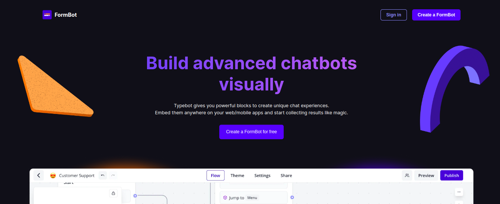
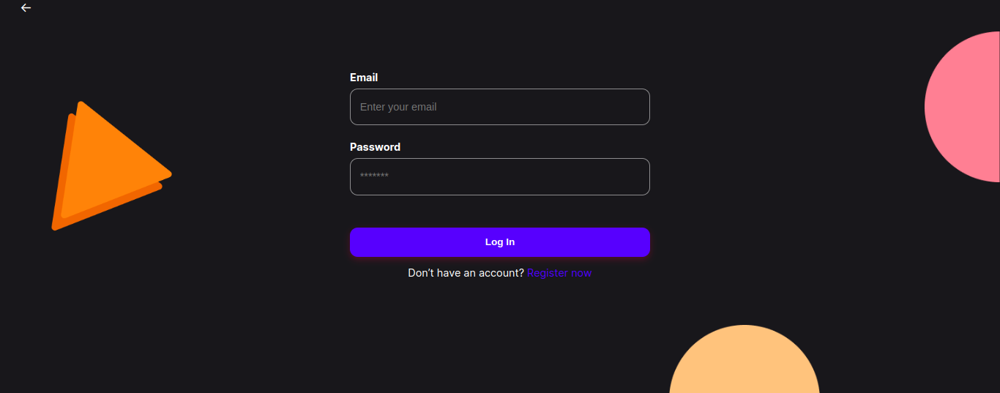
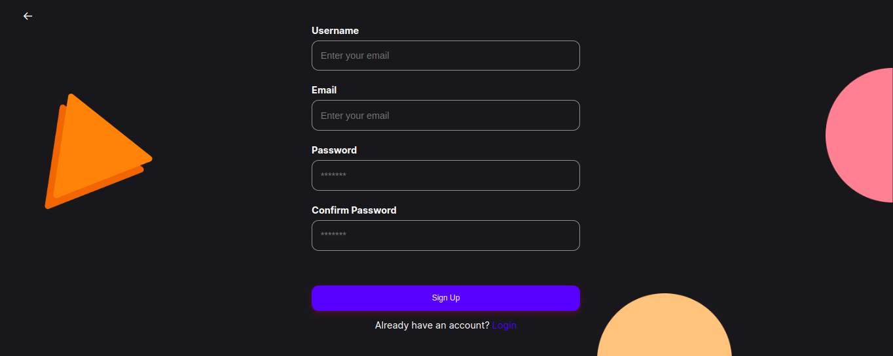
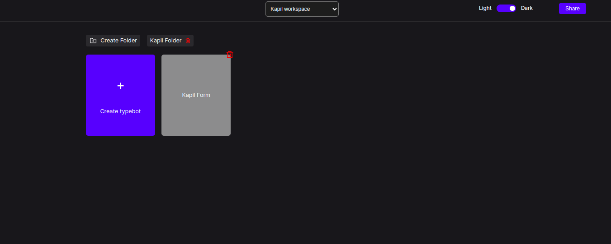
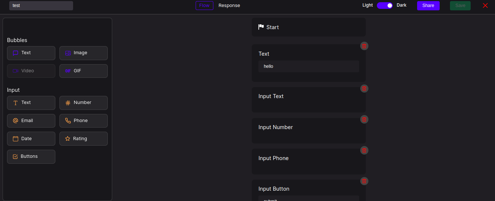
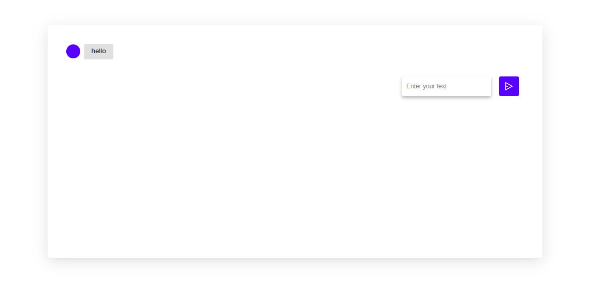
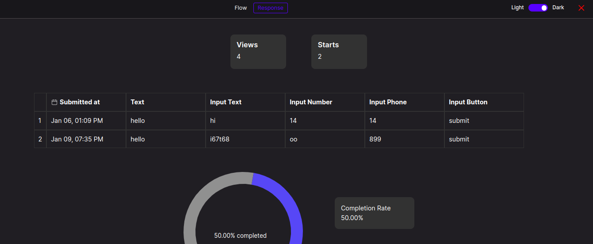

# Form Builder App - Frontend

Welcome to the Form Builder App frontend repository, where you can create and manage forms through a user-friendly interface.

## Table of Contents

- [Introduction](#introduction)
- [Features](#features)
- [Installation](#installation)
 
## Introduction

FormBot Chatbot Builder is a web application designed to create, customize, and deploy advanced chatbots through an interactive visual interface.

## Features

- Users can register and login securely using JWT tokens.
- Add a Theme Mode for switching between light and dark themes based on preference.
- Form fields are fully customizable, allowing users to define fields as per their requirements.
- Users can generate and share a unique URL for each formbot created.
- A dashboard is available to track views and completions of formbot responses.
- Users can share workspaces, assigning different levels of access (edit/view) to registered users.

## Installation

To get started with the frontend, follow these steps:

1. Clone the repository:
    ```bash
    git clone https://github.com/kapilmogre1998/Form-builder-app.git
    ```
2. Navigate to the frontend directory:
    ```bash
    cd Form-builder-app/Frontend
    ```
3. Install dependencies:
    ```bash
    npm install
    ```
4. To start the development server, run:
    ```bash
    npm run start
    ```

## Project Link -
https://form-builder-app-dun.vercel.app/

## Images

### Home Page


### Login Page


### Register Page


### Folder & File Workspace


### FormBot Workspace


### FormBot


### FormBot Response Dashboard



